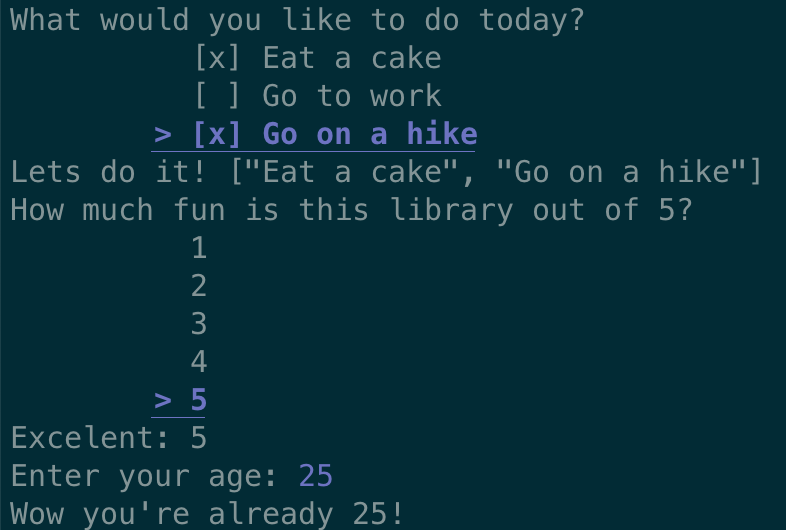

eprompt is a easy to use prompt library for rust.

No complicated structs, or traits. Just simple functions that do what they say.

Usage example:
```rust
use eprompt::*;

// user can use j, k, up or down to change selection. Space to check a box, enter to finalize.
let tasks: Vec<_> = multi_select("What would you like to do today?", &["Eat a cake", "Go to work", "Go on a hike"]).unwrap();

// user can use j, k, up or down to change selection, space or enter to finalize.
let selection: &f32 = select("Choose an option", &[6.9, 3.14])).unwrap();

// This will automatically parse the input to the desired type. If the input is invalid it will have the user try again.
let age: i32 = input("How old are you?").unwrap();
```


